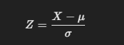
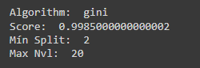
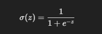
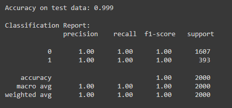
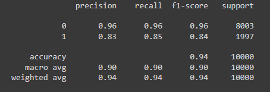
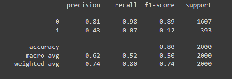
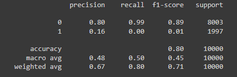
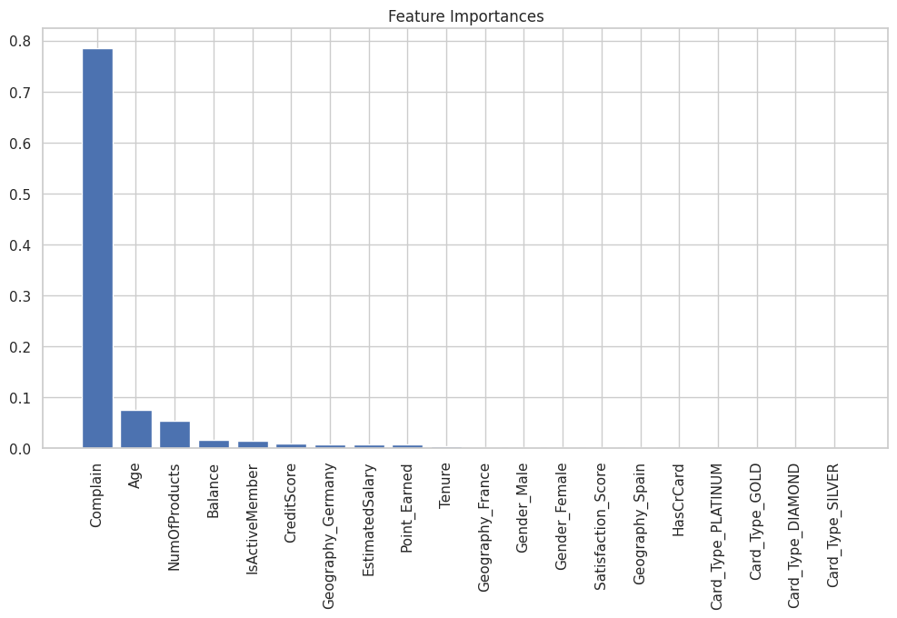

# Laporan Proyek Machine Learning - Ari Fansuri

## Domain Proyek

Pengamatan dilakukan menggunankan dataset sebuah perusahaan perbankan. Pengamatan ini bertujuan untuk merancang desain sistem *machine learning* yang berguna untuk meningkatkan performa perbankan dengan cara membangun strategi bisnis yang mampu mempertahankan jumlah nasabah. Fokus pada proyek ini adalah mengetahui seberapa banyak pelanggan yang mungkin akan berhenti menjadi nasabah di masa mendatang. Sistem yang dibangun akan berorientasi pada profil nasabah.

**Tinjauan Pustaka**:
- *Customer churn* terjadi ketika pelanggan berhenti melakukan pembelian. Hal itu dapat terjadi dari berbagai faktor. Untuk mengetahui keterkaitan antar variabel (faktor) terhadap kemungkinan churn, maka diperlukan proses feature selection. Selanjutnya, variabel yang dinilai secara statistik memiliki hubungan yang kuat, akan digunakan untuk pelatihan model machine learning dengan algoritma random forest. Pelanggan yang diklasifikasikan ke dalam kategori churn, akan mendapatkan tindakan analisis lanjutan berupa sistem rekomendasi produk yang berguna untuk menarik kembali minat pelanggan disertai strategi marketing dan promosi di masa mendatang.

- Churn rate yang tinggi menunjukkan bahwa banyak pelanggan yang memilih untuk tidak lagi membeli produk atau layanan dari perusahaan (Ahmed and Maheswari 2019). Pengujian dari 5 model untuk menentukan churn pada data perbankan,  dua model memiliki performa dan akurasi terbaik, yaitu random forest classifier dan KNeighbor classifier (Husein et,al., 2021). Sedangkan dari 12 literatur yang dibandingkan, nilai cosine similiarity dan akurasi model terbaik dapat diperolah menggunakan algoritma K-Nearest Neighbor dan Content Based filtering dalam memberikan rekomendasi kepada pengguna (Futri, Nur et,al., 2023).

**Daftar Pustaka:**
- Ahmed, Ammar A.Q., and D. Maheswari. 2019. “An Enhanced Ensemble Classifier for Telecom Churn Prediction Using Cost Based Uplift Modelling.” International Journal of Information Technology (Singapore) 11 (2): 381–91. https://doi.org/10.1007/s41870-018-0248-3.

- Husein, A.H., Harahap M., dan Fernandito P. 2021. "Pendekatan Data Science untuk Menemukan Churn Pelanggan pada Sector Perbankan dengan Machine Learning." dsi 2021, vol 1, number 1| https://doi.org/10.47709/dsi.v1i1.1169.
    
- Futri N.I.S., dan Fathonah Rd.Nuraini. 2023. "PENERAPAN METODE CONTENT BASED FILTERING DAN KNN PADA APLIKASI REKOMENDASI LAPTOP BERBASIS MOBILE" JATI (Jurnal Mahasiswa Teknik Informatika) Vol. 7 No. 2.

## Business Understanding

Customer churn di sektor perbankan merupakan tantangan besar yang dapat memengaruhi profitabilitas dan keberlanjutan bisnis. Pemahaman mendalam mengenai alasan churn sangat penting untuk mengembangkan strategi pencegahan yang efektif. Tahap business understanding ini mencakup analisis perilaku nasabah, pola penggunaan produk, serta interaksi dengan layanan bank. Faktor-faktor seperti ketidakpuasan terhadap layanan, persaingan ketat dari bank lain, dan perubahan kebutuhan nasabah berpotensi meningkatkan tingkat churn. Dengan memahami secara mendetail alasan di balik perilaku nasabah yang memutuskan hubungan dengan bank, institusi dapat mengenali segmen nasabah yang rentan dan menerapkan langkah-langkah preventif, seperti perbaikan layanan pelanggan, personalisasi penawaran produk, serta program loyalitas, untuk meningkatkan retensi nasabah dan memperbaiki pengalaman mereka.

### Problem Statements
- Bagaimana customer churn dapat terjadi pada perusahaan?
- Bagaimana performa dari tiap model dalam menganalisis pelanggan?
- Bagaimana model mampu beradaptasi dengan data baru selain data uji dan latih?

### Goals
- Mengetahui variabel yang menjadi faktor penyebab pelanggan berhenti menjadi nasabah.
- Mengetahui performa model dengan algoritma yang berbeda-beda berdasarkan metriks evaluasi.
- Memilih dan menguji model terbaik dengan tingkat akurasi lebih dari 90%.

### Solution statements
- Menilai variabel yang menjadi penyebab customer melakukan churn melalui penilaian dari persentase tertinggi pada model yang telah dipilih.
- Membandingkan model dengan algoritma yang berbeda-beda menggunakan data baru dan dinilai berdasarkan metriks evaluasi.
- Model dengan akurasi yang tinggi akan digunakan untuk menilai variabel yang mungkin menjadi penyebab customer melakukan churn.

## Data Understanding
### Variabel-variabel pada dataset Penjualan Elektronik adalah sebagai berikut:
| Kolom               | Tipe Data | Uraian                                                                                          |
|---------------------|-----------|-------------------------------------------------------------------------------------------------|
| RowNumber           | int64     | Jumlah baris.                                                                                   |
| CustomerId          | int64     | Mengandung nilai unik sebagai ID nasabah.                                                       |
| Surname             | object    | Nama belakang nasabah.                                                                          |
| CreditScore         | int64     | Skor kredit nasabah.                                                                            |
| Geography           | object    | Lokasi nasabah.                                                                                 |
| Gender              | object    | Jenis kelamin nasabah.                                                                          |
| Age                 | int64     | Usia nasabah.                                                                                   |
| Tenure              | int64     | Durasi nasabah menjadi pelanggan (tahun).                                                       |
| Balance             | float64   | Saldo rekening nasabah.                                                                         |
| NumOfProducts       | int64     | Jumlah produk yang dibeli nasabah melalui bank.                                                 |
| HasCrCard           | int64     | Kepemilikan kartu kredit (1 jika memiliki, 0 jika tidak).                                       |
| IsActiveMember      | int64     | Status aktivitas nasabah (1 jika aktif, 0 jika tidak).                                         |
| EstimatedSalary     | float64   | Estimasi gaji nasabah per tahun.                                                                |
| Exited              | int64     | Status churn (1 jika meninggalkan bank, 0 jika tetap).                                         |
| Complain            | int64     | Jumlah komplain yang diajukan nasabah.                                                          |
| Satisfaction Score  | int64     | Penilaian kepuasan pelanggan terhadap penyelesaian masalah yang dihadapi (skor 1-5).            |
| Card Type           | object    | Tipe kartu yang dimiliki nasabah.                                                               |
| Point Earned        | int64     | Jumlah poin yang dimiliki nasabah dari penggunaan kartu kredit.                                 |

Dataset *Bank Customer Churn* ini terdiri dari **10,000 baris** dan **18 kolom**, menyediakan data lengkap mengenai nasabah bank. Setiap kolom mewakili atribut spesifik nasabah, seperti `CreditScore`, `Age`, `Geography`, `NumOfProducts`, dan `Satisfaction Score`, yang dapat mendukung analisis perilaku nasabah dalam kaitannya dengan potensi churn, yaitu kemungkinan nasabah meninggalkan bank. Melalui analisis data ini, bank dapat lebih memahami faktor-faktor utama yang mendorong churn dan merancang strategi retensi nasabah yang lebih efektif. Dataset ini dapat diakses melalui tautan berikut: [Bank Customer Churn Dataset on Kaggle](https://www.kaggle.com/datasets/radheshyamkollipara/bank-customer-churn/data).

### Data Cleaning
Dari informasi variabel data diatas, terdapat kesalahan dalam penulisan kolom data. Beberapa kolom memiliki karakter penghubung menggunakan spasi, yaitu kolom satisfaction score, card type dan point earned. Untuk memudahkan pemrosesan data, kolom-kolom tersebut akan diubah menggunkan karakter underscore sebagai penghubungnya.

Berdasarkan dataset yang tersedia, terdapat beberapa kolom yang berisi nilai nol "0" dan tidak ditemukan data sel kosong "*Nan*". Sel bernilai nol "0" merupakan hasil transformasi data yang sebelumnya adalaha tipe data boolean. Sehingga nilai nol "0" pada dataframe *expected* sebagai representasi dari nilai *false*/*no*/tidak.

### Variabel Deskriptif
|                    | CreditScore   | Age         | Tenure      | Balance        | NumOfProducts | EstimatedSalary   | Satisfaction Score | Point Earned |
|--------------------|---------------|-------------|-------------|----------------|---------------|-------------------|---------------------|--------------|
| **count**          | 10000.000000  | 10000.000000 | 10000.000000 | 10000.000000 | 10000.000000 | 10000.000000     | 10000.000000       | 10000.000000 |
| **mean**           | 650.528800    | 38.921800    | 5.012800     | 76485.889288 | 1.530200      | 100090.239881    | 3.013800           | 606.515100   |
| **std**            | 96.653299     | 10.487806    | 2.892174     | 62397.405202 | 0.581654      | 57510.492818     | 1.405919           | 225.924839   |
| **min**            | 350.000000    | 18.000000    | 0.000000     | 0.000000     | 1.000000      | 11.580000        | 1.000000           | 119.000000   |
| **25%**            | 584.000000    | 32.000000    | 3.000000     | 0.000000     | 1.000000      | 51002.110000     | 2.000000           | 410.000000   |
| **50%**            | 652.000000    | 37.000000    | 5.000000     | 97198.540000 | 1.000000      | 100193.915000    | 3.000000           | 605.000000   |
| **75%**            | 718.000000    | 44.000000    | 7.000000     | 127644.240000 | 2.000000     | 149388.247500    | 4.000000           | 801.000000   |
| **max**            | 850.000000    | 92.000000    | 10.000000    | 250898.090000 | 4.000000     | 199992.480000    | 5.000000           | 1000.000000  |

Rata-rata skor kredit pelanggan adalah 650, yang relatif baik, sementara rata-rata gaji berada di kisaran 100.000. Usia rata-rata pelanggan sekitar 39 tahun dan lama bergabung (tenure) rata-rata 5 tahun, ini menunjukkan bahwa banyak pelanggan berada dalam usia produktif dan telah cukup lama menjadi bagian dari perusahaan. Tingkat retensi yang stabil ini dapat menjadi indikator loyalitas pelanggan. Skor kepuasan nasabah 3 (cukup puas) dan poin rata-rata adalah 606, yang menunjukkan tingkat keterlibatan dan kepuasan pelanggan yang cukup stabil.

### Univariate Analysis
Univariate analysis adalah teknik analisis statistik yang digunakan untuk mengevaluasi karakteristik dari satu variabel pada satu waktu. Tujuannya adalah memahami pola data yang ada pada satu variabel. Analisis ini memberikan gambaran awal mengenai karakteristik variabel yang dapat membantu dalam proses eksplorasi data.

#   

Berdasarkan hasil identifikasi outlier menggunakan boxplot, tidak ditemukan adanya outlier dan memang dianggap sebagai anomali yang sah dalam sebaran data. Berikut keterangan pada masing-masing fitur:

* Credit score: Outlier pada data credit score dianggap normal karena beberapa customer memiliki kredit score yang rendah.
* Age: Outlier pada kolom Age dianggap normal karena usia customer berada pada rentang yang dianggap normal sebagai usia manusia.
* Balance: Tidak ditemukan adanya outlier, namun kemungkinan besar data memiliki nilai rendah yang cukup dominan, sehingga distribusi data menjadi tidak normal dan mendorong box plot mendekati nilai minimum.

#   

Jumlah nasabah berkewarganegaraan Prancis mendominasi keseluruhan jumlah customer, yaitu sebanyak 50,14%. Sedangkan untuk Jerman dan Spanyol memiliki jumlah persentase yang hampir sama, yaitu sekitar 25%.

#   

Pada masing-masing tipe kartu memiliki besaran data yang seimbang di range sekitar 25% atau sekitar 2500 pengguna per-tipe kartu.

#   

Pengguna dengan jenis kelamin laki-laki mendominasi sebesar 54,57% dan pengguna dengan jenis kelamin perempuan sebesar 45,43%.

### Multivariate Analysis
Multivariate analysis adalah teknik analisis statistik yang mengevaluasi hubungan antara dua atau lebih variabel secara bersamaan. Tujuan utama dari analisis ini adalah untuk mengidentifikasi pola, keterkaitan, dan korelasi antar variabel yang mungkin tidak terlihat melalui analisis satu variabel (univariate). Dalam data yang kompleks, multivariate analysis membantu untuk memahami interaksi antara beberapa variabel yang dapat memberikan *insight* lebih mendalam.

#   

Dari hasil analisis menggunakan pairplot, fitur seperti NumOfProducts, Age, dan Balance masih menunjukkan perbedaan yang berarti antara pelanggan yang churn dan yang tidak churn. Fitur Complain menambah perspektif, karena pelanggan dengan keluhan lebih mungkin untuk churn, terutama jika keluhan tersebut berhubungan dengan faktor kepuasan.

#   

Heatmap di atas menunjukkan matriks korelasi antara berbagai fitur dalam dataset. Korelasi diukur dalam rentang -1 hingga 1, di mana:

- Nilai 1 (merah terang), menunjukkan korelasi positif yang sempurna antara dua fitur, artinya peningkatan satu variabel cenderung diikuti oleh peningkatan variabel lainnya.
- Nilai -1 (biru terang), menunjukkan korelasi negatif yang sempurna, di mana peningkatan satu variabel cenderung diikuti oleh penurunan variabel lainnya.
- Nilai mendekati 0 (biru gelap), menunjukkan tidak adanya atau sedikit korelasi antara dua fitur.  

**Temuan Utama:**
1. Korelasi tertinggi: Complain memiliki sempurna dengan variabel Exited, yaitu sebesar 1 yang menunjukan adanya variabel positif yang menunjukan kecenderungan bahwa customer yang melakukan complain akan sangat mungkin melakukan Churn.
2. Korelasi lainnya: Korelasi lainnya dalam dataset ini adalah antara Age dan Exited dengan nilai 0.29, menunjukkan bahwa usia memiliki hubungan positif yang lemah dengan variabel target Exited.
3. Korelasi Negatif: Ada korelasi negatif antara IsActiveMember dan Exited (-0.16), menunjukkan bahwa pelanggan yang aktif cenderung memiliki peluang lebih rendah untuk keluar dari layanan. Namun, nilai korelasinya juga cukup rendah.
4. Fitur Lainnya: Sebagian besar fitur memiliki korelasi sangat rendah satu sama lain, seperti *CreditScore* terhadap fitur lain yang hampir semuanya berada di sekitar 0. Ini menunjukkan bahwa sebagian besar fitur cukup independen.

#   

Dari hasil analisis variabel numerik vs exited menggunakan `boxplot`, Age tampak sebagai variabel yang paling relevan dalam membedakan antara pelanggan yang churn dan yang tidak. Variabel lain seperti NumOfProducts juga menunjukkan sedikit perbedaan, namun tidak sejelas variabel Age. Variabel lainnya, seperti CreditScore, Tenure, Balance, EstimatedSalary, Satisfaction_Score, dan Point_Earned, menunjukkan distribusi yang hampir serupa untuk kedua kelompok dan mungkin memiliki pengaruh yang lebih kecil terhadap churn.

## Data Preparation
### Drop Fitur dan Encoding Data
Pada tahap ini, beberapa langkah pra-pemrosesan diterapkan pada dataset agar model lebih mudah dalam memahami data:

1. Menghapus Kolom yang Tidak Relevan: Kolom RowNumber, Surname, dan CustomerId dihapus dari dataset karena tidak berkontribusi langsung terhadap prediksi.

2. Encoding Variabel Kategorikal: Kolom kategorikal seperti Geography, Gender, dan Card_Type dikonversi menjadi bentuk numerik menggunakan teknik One-Hot Encoding. Hasil encoding ini disimpan dalam variabel hot.

3. Menggabungkan Hasil Encoding: Dataset utama df dikombinasikan dengan data hasil encoding (`hot`) sehingga informasi dalam variabel kategorikal sekarang tersimpan sebagai kolom numerik.

4. Menghapus Kolom Kategorikal Asli: Setelah encoding, kolom asli Geography, Gender, dan Card_Type dihapus dari dataset untuk menghindari redundansi.

5. Mempersiapkan Fitur dan Label: Semua kolom kecuali Exited diambil sebagai fitur (`X`), sementara kolom Exited dijadikan label (`y`). Fitur `X` diubah ke dalam bentuk array untuk memudahkan proses pelatihan model.

Dalam proyek ini, variabel kategorikal seperti Geography, Gender, dan Card_Type perlu diubah menjadi format numerik agar dapat diproses oleh model machine learning. Kebanyakan algoritma machine learning hanya dapat bekerja dengan data numerik, sehingga encoding pada variabel kategorikal diperlukan untuk memastikan kompatibilitas data dengan model. *One-Hot Encoding* dipilih karena teknik ini efektif dalam menangani variabel kategorikal tanpa memperkenalkan urutan atau hierarki yang mungkin tidak ada.

### Split Dataset
Pada project ini, dataset dibagi menjadi dua bagian menggunakan `train_test_split` dari library scikitlearn, yaitu data pelatihan dan data pengujian, dengan perbandingan 80:20. Artinya, 80% dari data digunakan untuk melatih model, sementara 20% sisanya digunakan untuk menguji performa model. Pembagian ini bertujuan untuk memastikan bahwa model dapat mempelajari pola dari data pelatihan, dan kemudian diuji pada data pengujian yang belum pernah dilihat model sebelumnya.

### Standarisasi data
Standarisasi adalah teknik praproses data yang digunakan untuk mengubah skala data agar dapat digunakan lebih optimal oleh algoritma machine learning. Standarisasi mengubah data sehingga memiliki mean (rata-rata) 0 dan standard deviation (deviasi standar) 1. Rumus standarisasi adalah sebagai berikut:

#   

Di mana 𝑋 adalah nilai asli, μ adalah rata-rata, dan σ adalah deviasi standar dari data.

## Modeling
Dalam proses pengembangan model, pemilihan parameter yang optimal sangat penting untuk meningkatkan kinerja model serta mencegah overfitting atau underfitting. Pada kode ini, digunakan dua teknik pencarian parameter untuk model `RandomForestClassifier`: **GridSearchCV** dan **RandomizedSearchCV**.

1. **GridSearchCV**: Teknik ini digunakan untuk melakukan pencarian komprehensif terhadap kombinasi parameter tertentu yang didefinisikan dalam `param_grid`. `GridSearchCV` mengevaluasi semua kemungkinan kombinasi dari parameter `n_estimators`, `min_samples_split`, `max_depth`, dan `criterion`. Dengan menggunakan cross-validation sebanyak 5 kali (`cv=5`), `GridSearchCV` mengevaluasi setiap kombinasi parameter secara sistematis untuk memilih konfigurasi terbaik. Meskipun sangat efektif, teknik ini bisa menjadi lambat karena harus mencoba semua kemungkinan kombinasi.

2. **RandomizedSearchCV**: Teknik ini adalah alternatif yang lebih efisien dari `GridSearchCV`, di mana hanya sebagian dari kombinasi parameter yang dicoba secara acak. Dengan cara ini, `RandomizedSearchCV` dapat mengurangi waktu komputasi secara signifikan sambil tetap berpotensi menemukan parameter yang optimal. Pada kode ini, `RandomizedSearchCV` juga menggunakan cross-validation dengan 5 lipatan dan bekerja secara paralel (`n_jobs=-1`) untuk mempercepat proses. Setelah parameter terbaik ditemukan, hasil seperti *criterion* terbaik, skor terbaik (*best score*), *min_samples_split*, dan *max_depth* yang optimal akan dicetak, membantu kita memahami konfigurasi terbaik dari model.

Berdasarkan hasil pemilihan parameter, diperoleh parameter terbaik sebagai berikut:
#   

- **Algoritma**: Gini
  - Model ini menggunakan algoritma *Decision Tree* dengan *impurity criterion* berdasarkan *Gini index* untuk memisahkan data.

- **Score**: 0.9985
  - Skor model ini mencapai **99.85%**, menunjukkan performa yang sangat baik dalam mengklasifikasikan data dengan akurasi tinggi.

- **Min Split**: 2
  - Model memiliki parameter *minimum split* sebesar **2**, yang artinya sebuah node akan terbagi jika ada setidaknya 2 sample yang dapat dipisahkan.

- **Max Depth**: 20
  - Kedalaman maksimum (*maximum depth*) dari pohon keputusan ini dibatasi hingga **20 level**, untuk mengontrol ukuran pohon dan menghindari overfitting.

Dalam proyek ini menggunakan dua algoritma *Random Forest* dan *Logistic Regression*. Masing-masing algoritma ini memiliki kelebihan dan kekurangannya, sehingga memungkinkan untuk membandingkan performa keduanya untuk mendapatkan nilai akurasi terbaik.

### 1. **Random Forest**:
Algoritma Random Forest bekerja dengan cara membangun sejumlah pohon keputusan (decision trees) secara independen melalui proses yang disebut *Bagging (Bootstrap Aggregating)*. Pada intinya, setiap pohon dalam hutan dibangun dari subset acak dari data pelatihan, dengan beberapa karakteristik utama sebagai berikut:
   - **Bootstrap Sampling**: Setiap pohon dilatih pada subset acak yang diambil dari data pelatihan. Teknik ini menghasilkan variasi di antara pohon-pohon karena data yang berbeda dipilih pada setiap iterasi.
   - **Pemilihan Fitur Acak**: Setiap kali sebuah node dalam pohon harus dibagi, algoritma hanya mempertimbangkan subset acak dari fitur yang ada, sehingga setiap pohon melihat fitur yang berbeda-beda. Ini mengurangi korelasi antar pohon dan meningkatkan ketahanan terhadap overfitting.
   
Pada langkah pertama, sejumlah `n_estimators` pohon keputusan dibangun. Setiap pohon dilatih secara independen pada subset data yang berbeda dengan karakteristik pohon:
   - **Min Samples Split**: Jumlah minimum sampel yang diperlukan untuk membagi node pada pohon, yang mengontrol pertumbuhan pohon.
   - **Max Depth**: Kedalaman maksimum dari pohon, yang menjaga pohon tidak tumbuh terlalu dalam (overfitting).
   - **Criterion**: Fungsi yang digunakan untuk menilai kualitas pembelahan, seperti "gini" atau "entropy".

Untuk klasifikasi, prediksi akhir ditentukan melalui voting mayoritas dari prediksi yang dihasilkan oleh masing-masing pohon. Jika terdapat tiga kelas, setiap pohon menghasilkan prediksi untuk salah satu kelas tersebut, dan kelas yang paling sering diprediksi oleh seluruh pohon akan menjadi output akhir Random Forest.

##### Kelebihan
   - **Ketahanan terhadap Overfitting**: Karena setiap pohon hanya melihat subset data dan fitur yang berbeda, Random Forest lebih tahan terhadap overfitting dibandingkan algoritma single tree.
   - **Kemampuan Generalisasi yang Baik**: Algoritma ini umumnya memiliki akurasi tinggi pada data uji, karena setiap pohon memiliki kontribusi yang berbeda untuk hasil akhir.
   - **Fleksibilitas**: Random Forest dapat digunakan untuk tugas klasifikasi dan regresi, serta memiliki kemampuan menangani data non-linear tanpa memerlukan skala data tertentu.

##### Kekurangan
   - **Kompleksitas Komputasi**: Membangun dan mengevaluasi banyak pohon membutuhkan waktu dan sumber daya komputasi yang besar, terutama jika `n_estimators` tinggi.
   - **Interpretabilitas Terbatas**: Karena model adalah kombinasi dari banyak pohon, sulit untuk diinterpretasikan atau diuraikan logikanya dibandingkan dengan Decision Tree tunggal.

### 2. **Logistic Regression**
**Logistic Regression** adalah algoritma machine learning untuk klasifikasi biner, digunakan untuk memprediksi apakah sebuah data termasuk ke dalam salah satu dari dua kelas (contohnya, positif atau negatif). Logistic Regression memprediksi probabilitas bahwa data masuk ke dalam kelas tertentu. Jika probabilitas tersebut lebih besar dari 0.5, data diklasifikasikan sebagai 1, dan jika kurang dari 0.5, diklasifikasikan sebagai 0.

Logistic Regression menggunakan fungsi *sigmoid* untuk mengubah output linear menjadi probabilitas, dengan rumus:

#   

Penjelasan:
- \( w \) sebagai bobot (koefisien)
- \( x \) sebagai fitur
- \( b \) sebagai bias

Fungsi sigmoid menghasilkan output antara 0 dan 1, yang mewakili probabilitas.

Parameter \( w \) dan \( b \) dalam Logistic Regression diestimasi menggunakan metode *maximum likelihood estimation (MLE)*. Ini berarti  mencari nilai \( w \) dan \( b \) yang memaksimalkan peluang model memprediksi label dengan benar.

##### Kelebihan
  - Mudah diimplementasikan dan dipahami.
  - Efisien untuk dataset kecil.
##### Kekurangan
  - Hanya cocok untuk masalah biner.
  - Sulit menangani data yang sangat kompleks atau tidak linier.

Logistic Regression sering digunakan untuk masalah seperti deteksi spam, prediksi churn, dan analisis kredit, karena kesederhanaan dan efektifitasnya.

## Evaluation
#### Accuracy
*Accuracy* mengukur persentase prediksi yang benar dibandingkan dengan total data. Rumusnya:

    Accuracy = (True Positives + True Negatives) / Total Samples

#### Precision
*Precision* mengukur seberapa banyak prediksi positif yang benar dari semua prediksi positif yang dihasilkan. Precision berguna dalam kasus di mana *false positives* harus diminimalkan, misalnya dalam deteksi spam. Rumusnya:

    Precision = True Positives / (True Positives + False Positives)

Precision yang tinggi berarti model memiliki sedikit kesalahan positif.

#### Recall
*Recall* (atau Sensitivitas) mengukur seberapa banyak prediksi positif yang benar dari keseluruhan sampel positif. Recall penting jika *false negatives* harus diminimalkan, seperti dalam diagnosis penyakit. Rumusnya:

    Recall = True Positives / (True Positives + False Negatives)

Recall yang tinggi berarti model berhasil menangkap sebagian besar sampel positif.

#### F1 Score
*F1 Score* adalah metrik yang menggabungkan precision dan recall menjadi satu nilai. Ini adalah rata-rata harmonis antara precision dan recall, berguna jika kita ingin mempertimbangkan kedua metrik secara bersamaan, terutama jika kelas tidak seimbang. Rumusnya:

    F1 Score = 2 * (Precision * Recall) / (Precision + Recall)

Nilai F1 Score berada di antara 0 dan 1, di mana 1 menunjukkan model yang sempurna. 

### Perbandingan Model
#### 1. Model Random Forest

<figcaption>Gambar 1.1: Metrik evaluasi Random Forest dengan data asli.</figcaption>
  

Model yang diuji menunjukkan hasil yang sangat baik pada data uji dengan akurasi 99.9%. Ini berarti bahwa model berhasil mengklasifikasikan hampir semua sampel dengan benar. Rata-rata untuk semua metrik (macro avg dan weighted avg) menunjukkan nilai sempurna (1.00), mengindikasikan kinerja yang konsisten di seluruh kelas.

Secara keseluruhan, model ini memiliki performa yang sangat tinggi dalam mendeteksi kedua kelas pada data uji, dengan tingkat kesalahan yang mendekati nol.

<figcaption>Gambar 1.2: Metrik evaluasi Random Forest dengan data sintetis.</figcaption>
  

Berdasarkan hasil evaluasi, model *RandomForestClassifier* mencapai akurasi sebesar 0.95 atau 95% pada data sintetis. Berikut adalah penjelasan lebih detail dari hasil classification report:

- **Class 0** (label mayoritas):
  - **Precision**: 0.96, menunjukkan bahwa 96% dari prediksi untuk kelas ini benar.
  - **Recall**: 0.96, menunjukkan bahwa model berhasil mengidentifikasi 96% dari semua instance sebenarnya dalam kelas ini.
  - **F1-Score**: 0.96, yang merupakan kombinasi dari precision dan recall, menunjukkan performa model yang konsisten pada kelas ini.

- **Class 1** (label minoritas):
  - **Precision**: 0.83, menunjukkan bahwa 83% dari prediksi untuk kelas ini benar.
  - **Recall**: 0.90, menunjukkan bahwa model berhasil mengidentifikasi 90% dari semua instance sebenarnya dalam kelas ini.
  - **F1-Score**: 0.84, yang menunjukkan kinerja yang baik meskipun lebih rendah daripada kelas mayoritas.

- **Akurasi Keseluruhan**: Model mencapai akurasi 94%, yang berarti bahwa 94% prediksi pada data sintetis adalah benar.
  
- **Macro Average**: Nilai rata-rata precision, recall, dan F1-score untuk kedua kelas adalah 0.90, yang memberikan gambaran kinerja rata-rata untuk masing-masing kelas.
  
- **Weighted Average**: Nilai rata-rata precision, recall, dan F1-score dengan mempertimbangkan proporsi setiap kelas adalah 0.94, yang menunjukkan bahwa model memiliki kinerja keseluruhan yang baik, terutama pada kelas mayoritas.

Secara keseluruhan, model menunjukkan performa yang sangat baik dalam memprediksi kelas mayoritas, dengan performa yang cukup baik juga untuk kelas minoritas.

#### 2. Model Logistic Regression

<figcaption>Gambar 2.1: Metrik evaluasi Logistic Regression dengan data asli.</figcaption>
  

Model *Logistic Regression* memiliki kelemahan yang cukup signifikan dalam mendeteksi kelas minoritas, yang terlihat dari rendahnya nilai recall (0.07) dan F1-score (0.12) pada kelas tersebut.

Perbedaan utama antara kedua model ini adalah:
- **Akurasi Keseluruhan**: Random Forest (99.85%) jauh lebih tinggi dibandingkan Logistic Regression (80%).
- **Kinerja pada Kelas Minoritas**: Random Forest dapat memprediksi kelas minoritas dengan jauh lebih baik dibandingkan Logistic Regression, yang mengalami kesulitan dalam mendeteksi instance kelas ini.
- **General Performa**: Random Forest menghasilkan model yang lebih andal dan seimbang pada kedua kelas, sementara Logistic Regression tampak bias terhadap kelas mayoritas.

<figcaption>Gambar 2.2: Metrik evaluasi Logistic Regression dengan data sintetis.</figcaption>
  

Model *Logistic Regression* menghasilkan akurasi sebesar 0.80 atau 80% pada data sintetis. Berikut adalah ringkasan hasil evaluasi berdasarkan classification report:

- **Class 0** (label mayoritas):
  - **Precision**: 0.80, yang berarti 80% prediksi kelas 0 adalah benar.
  - **Recall**: 0.99, menunjukkan bahwa model berhasil mengidentifikasi 99% dari semua instance sebenarnya di kelas ini.
  - **F1-Score**: 0.89, menunjukkan performa yang baik pada kelas mayoritas.

- **Class 1** (label minoritas):
  - **Precision**: 0.16, menunjukkan bahwa hanya 16% dari prediksi kelas 1 adalah benar.
  - **Recall**: 0.00, menunjukkan model hanya mengidentifikasi 0% dari instance yang sebenarnya di kelas ini.
  - **F1-Score**: 0.01, yang menunjukkan performa yang lemah pada kelas ini.

- **Akurasi Keseluruhan**: Model mencapai akurasi 80%, yang menunjukkan bahwa 80% prediksi pada data sintetis adalah benar.

- **Macro Average**: Rata-rata precision, recall, dan F1-score untuk kedua kelas adalah sekitar 0.48, 0.5, dan 0.45. Nilai ini menunjukkan bahwa kinerja pada kedua kelas, terutama kelas minoritas, masih rendah.

- **Weighted Average**: Nilai rata-rata precision, recall, dan F1-score dengan mempertimbangkan proporsi masing-masing kelas adalah sekitar 0.67, 0.80, dan 0.71, yang menunjukkan performa yang lebih baik pada kelas mayoritas

Model *Random Forest* yang diuji pada data sintetis sebelumnya memberikan hasil yang jauh lebih baik, dengan akurasi sebesar 95% dan kinerja yang lebih seimbang pada kedua kelas, termasuk kelas minoritas. Perbedaan utama antara kedua model ini adalah:
- Akurasi Keseluruhan: Random Forest (95%) lebih tinggi dibandingkan Logistic Regression (80%).
- Kinerja pada Kelas Minoritas: Random Forest menunjukkan performa yang lebih baik dalam memprediksi kelas minoritas dibandingkan Logistic Regression, yang mengalami kesulitan dengan nilai recall yang rendah (0.18) pada kelas tersebut.
- Performa: Random Forest memberikan hasil yang lebih andal dan seimbang untuk kedua kelas, sementara Logistic Regression cenderung bias terhadap kelas mayoritas.

# 
Berdasarkan hasil evaluasi, model terbaik dipilih berdasarkan akurasi dan metrik evaluasi *Confusion Matrix* dari data sintetis yang diasumsikan sebagai data baru. *Random Forest* dipilih sebagai model terbaik karena memiliki performa yang lebih baik secara keseluruhan dibandingkan Logistic Regression dalam memprediksi data uji, data latih dan data sintetis. Meskipun Logistic Regression lebih cepat, Random Forest menawarkan akurasi yang lebih tinggi dan stabilitas dalam pengambilan keputusan, menjadikannya pilihan yang lebih tepat untuk kebutuhan bisnis.

# 

Berdasarkan grafik Feature Importances dari model Random Forest untuk memprediksi customer churn, dapat dijumpai beberapa hal penting tentang fitur-fitur yang paling mempengaruhi hasil prediksi:
- Complain: Fitur ini memiliki pengaruh yang paling besar dalam memprediksi churn, dengan nilai penting yang jauh lebih tinggi dibandingkan fitur lainnya. Ini menunjukkan bahwa pelanggan yang memiliki keluhan (complain) memiliki kemungkinan yang lebih tinggi untuk churn (berhenti menggunakan layanan).
- Age: Fitur umur pelanggan juga cukup berpengaruh, meskipun jauh di bawah complain. Hal ini bisa mengindikasikan bahwa usia tertentu lebih rentan untuk melakukan churn.
- NumOfProducts dan Balance: Kedua fitur ini juga memiliki pengaruh yang cukup signifikan dibandingkan dengan fitur lainnya. Kemungkinan besar, jumlah produk yang dimiliki pelanggan dan saldo mereka juga berkaitan dengan keputusan mereka untuk tetap menggunakan atau meninggalkan layanan.
- Fitur Lainnya: Sebagian besar fitur lainnya, seperti CreditScore, Geography, dan Gender, memiliki nilai penting yang jauh lebih kecil. Ini menunjukkan bahwa mereka tidak terlalu berpengaruh dalam model ini.

Dari hasil yang telah diperoleh, dapat disimpulkan bahwa keluhan pelanggan (complain) merupakan indikator terkuat untuk churn, diikuti oleh umur dan jumlah produk yang dimiliki. Dengan demikian, jika perusahaan ingin mengurangi churn, fokus utama sebaiknya pada peningkatan layanan pelanggan dan penanganan keluhan. Menyediakan layanan yang lebih baik untuk kelompok umur tertentu atau produk tambahan yang relevan.
